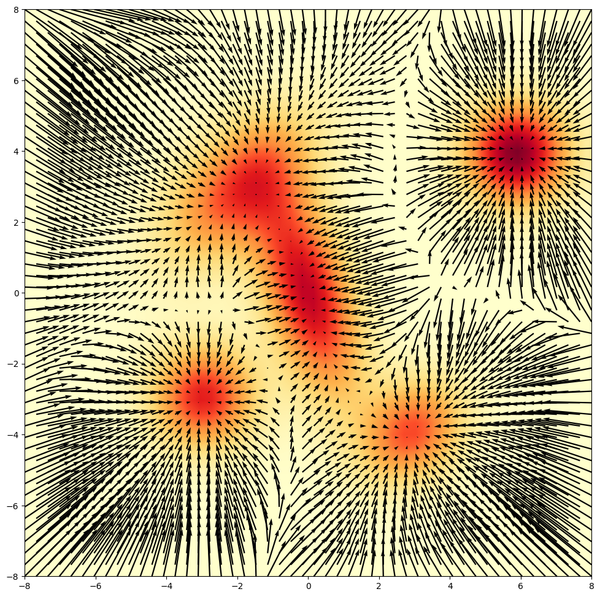

This is my note and my self derived math for learning Diffusion and relevant things.

# I. Gaussian Distribution and its gradient

## Standard Gaussian

## Multivariate Gaussian Density Function

$$
\mathcal{N} (x \vert \mu, \Sigma) = \frac{\exp( - \frac{1}{2} (x - \mu)^T \Sigma ^{-1} (x - \mu) )}{\sqrt{(2\pi)^k \vert \Sigma \vert }}
$$

Where: 

$$
\begin{cases}
x: \text{data}, \\
\mu: \text{mean matrix}, \\
\Sigma: \text{covariance matrix}, \\
k:  \text{dimensions of data.}
\end{cases}
$$

## Multivariate Gaussian Log Density Function

$$
\log(\mathcal{N} (x \vert \mu, \Sigma)) = - \frac{1}{2} (x - \mu)^T \Sigma ^{-1} (x - \mu) - \log(\sqrt{(2\pi)^k \vert \Sigma \vert })
$$

## Gradient of Multivariate Gaussian Density Function

Let: 

$$
C = \frac{1}{\sqrt{(2\pi)^k \vert \Sigma \vert}}
$$ 

By the chain rule, we have:

$$
\nabla_x \mathcal{N} (x \vert \mu, \Sigma) = C \exp(- \frac{1}{2} (x - \mu)^T \Sigma ^{-1} (x - \mu)) \nabla_x (- \frac{1}{2} (x - \mu)^T \Sigma ^{-1} (x - \mu))
$$

Let:

$$
f(x) = (x - \mu)^T \Sigma^{-1} (x - \mu)
$$

Taking the differential of both side and product rule, we have:

$$
\begin{aligned}
df &= d((x - \mu)^T \Sigma^{-1} (x - \mu)) \\
   &= (d(x - \mu))^T \Sigma^{-1} (x-\mu) + (x - \mu)^T \Sigma^{-1} d(x-\mu) \\
   &= (x-\mu)^T {\Sigma^{-1}}^T d(x-\mu) + (x - \mu)^T \Sigma^{-1} d(x-\mu) \\
   &= (x-\mu)^T ({\Sigma^{-1}}^T+\Sigma^{-1})d(x-\mu) \\
   &= (\nabla_x f(x))^T d(x-\mu) \\
   \implies \nabla_x f(x) &= (x-\mu)^T (\Sigma^{-1}+{\Sigma^{-1}}^T)
\end{aligned}
$$

The covariance matrix is symmetric. Thus:

$$
\nabla_x (- \frac{1}{2} f(x)) = - \frac{1}{2} (x-\mu)^T (\Sigma^{-1}+{\Sigma^{-1}}) = (x-\mu)^T \Sigma^{-1}
$$

Finally, the gradient of multivariate Gaussian density function is:

$$
\nabla_x \mathcal{N} (x \vert \mu, \Sigma) = C \exp(- \frac{1}{2} (x - \mu)^T \Sigma ^{-1} (x - \mu)) \times (\Sigma^{-1} (x-\mu)) = \frac{\exp(- \frac{1}{2} (x - \mu)^T \Sigma ^{-1} (x - \mu)) \times (\Sigma^{-1} (x-\mu))}{\sqrt{(2\pi)^k \vert \Sigma \vert}}
$$

## Gradient of Multivariate Gaussian Log Density Function/Score Fuction

$$
\nabla_x \log(\mathcal{N} (x \vert \mu, \Sigma)) = - \Sigma^{-1} (x-\mu)
$$

## Gaussian mixtures

The Gaussian mixture is given by a weighted sum of Gaussian distributions:

$$
\sum_{i=1}^{n} q_i \mathcal{N}(x \vert \mu, \Sigma), \text{where } q_i \in \mathbb{R}, \sum_{i=1}^{n}q_i=1. 
$$

# II. Sampling from a distribution

### 1. Why sampling is hard

Sometimes, we may know a function proportional to the true density:

$$
\tilde{p}(x) \propto p(x)
$$

This means $\tilde{p}(x)$ has the same shape as $p(x)$, but it may not integrate to 1. To make it a valid probability density, we need to divide by the normalizing constant which is very difficult to compute in high dimensions.

$$
p(x) = \frac{\tilde{p}(x)}{Z}
$$

where:

$$
Z = \int \tilde{p}(x)dx
$$

The constant $Z$ makes sure that:

$$
\int p(x)dx = 1
$$

However, the score function does not depend on $Z$. Taking logarithm both side, we have:

$$
\log p(x) = \log \tilde{p}(x) - \log Z
$$

Thus, we have score function:

$$
\nabla_x \log p(x) = \nabla_x \log \tilde{p}(x) - \nabla_x \log Z 
$$

Because $Z$ is constant with respect to $x$. Therefore:

$$
\nabla_x \log p(x) = \nabla_x \log \tilde{p}(x)
$$

## 2. Gradient Ascent on Log Density

The score function is:

$$
s(x) = \nabla_x \log p(x) 
$$

It points in the direction where the log-density increases fastest. 

So one simple idea is to update a point by gradient ascent:

$$
x_{k+1} = x_k + \eta \nabla_x \log p(x_k) = x_k + \eta s(x_k)
$$

where $\eta > 0$ is the step size.

For a Gaussian:

$$
p(x) = \mathcal{N}(x \mid \mu, \Sigma)
$$

We already know:

$$
\nabla_x \log p(x) = -\Sigma^{-1}(x-\mu)
$$

Therefore:

$$
x_{k+1} = x_k - \eta \Sigma^{-1}(x_k-\mu)
$$

So the point is 'go to' the mean $\mu$. This means gradient ascent is deterministic, if we start from same $x_0$, we always get the same result. But sampling means generating many points whose distribution follows $p(x)$:

$$
x \sim p(x)
$$

## 3. Langevin Dynamics

To make gradient ascent become a sampling method, Langevin dynamics adds Gaussian noise:

$$
x_{k+1} = x_k + \eta \nabla_x \log p(x_k) + \sqrt{2 \eta} \epsilon_k = x_k + \eta s(x_k) + \sqrt{2\eta}\epsilon_k
$$

where:

$$
\epsilon_k \sim \mathcal{N}(0,I)
$$

### Example: Standard Gaussian

Let:

$$
p(x) = \mathcal{N}(0,I)
$$

The log-density is:

$$
\log p(x) = -\frac{1}{2}x^Tx + C
$$

where $C$ is constant with respect to $x$. Taking the gradient:

$$
\nabla_x \log p(x) = -x
$$

Therefore, the Langevin update becomes:

$$
x_{k+1} = x_k + \eta(-x_k) + \sqrt{2\eta}\epsilon_k = (1-\eta)x_k + \sqrt{2\eta}\epsilon_k
$$

We can obvious see the first term $(1-\eta)x_k$ force the sample toward the mean $0$. But it do not go straight here because we have the second term that inject noise to this process, that make the sample keeps moving around the high-density region.

The next section will show how and why we can inject noise but still reserve our source distribution, this just work in this specific case not generalization. The author of blog [Langevin Diffusion Tutorial: Hands-on Introduction](https://www.peterholderrieth.com/blog/2023/Langevin-Dynamics-An-introduction-for-Machine-Learning-Engineers/) has a good more generalize version.

### Mean of the update

Consider the $1 \text{-d}$ case:

$$
x_{k+1} = (1-\eta)x_k + \sqrt{2\eta}\epsilon_k
$$

where:

$$
\epsilon_k \sim \mathcal{N}(0, 1)
$$

Taking expectation both sides, we have:

$$
\mathbb{E}[x_{k+1}] = \mathbb{E}[(1-\eta)x_k + \sqrt{2\eta}\epsilon_k]
$$

Since:

$$
\mathbb{E}[\epsilon_k] = 0
$$

We have:

$$
\mathbb{E}[x_{k+1}] = (1-\eta)\mathbb{E}[x_k]
$$

With $0 < \eta < 1$, $\mathbb{E}[x_k] \rightarrow 0$, thus we can confirm that the mean of the samples move toward to mean of the target Gaussian.

### Variance of the update

Let:

$$
v_k = \mathrm{Var}(x_k)
$$

Using:

$$
x_{k+1} = (1-\eta)x_k + \sqrt{2\eta}\epsilon_k
$$

Assuming $x_k$ and $\epsilon_k$ are independent, we have:

$$
\mathrm{Var}(x_{k+1}) = \mathrm{Var}((1-\eta)x_k) + \mathrm{Var}(\sqrt{2\eta}\epsilon_k)
$$

Therefore:

$$
v_{k+1} = (1-\eta)^2v_k + 2\eta
$$

At equilibrium, the variance does not change, so:

$$
v_{k+1} = v_k = v
$$

Thus:

$$
v = (1-\eta)^2v + 2\eta 
$$

Factor $v$, we have:

$$
\begin{aligned}
v - (1-\eta)^2v &= 2\eta \\
v[1-(1-\eta)^2] &= 2\eta \\
v[1-1+2\eta - \eta^2] &= 2\eta \\
v(2\eta-\eta^2) &= 2\eta \\
\end{aligned}
$$

And:

$$
v = \frac{2\eta}{2\eta-\eta^2} = \frac{2}{2-\eta} = 1 \quad \text{when } \eta \rightarrow 0
$$

So for the enough small step $\eta$, the Langevin update approximately preserves the variance of the standard Gaussian. 

 
# References:

[The Principles of Diffusion Models](https://arxiv.org/abs/2510.21890)

[Flow Matching and Diffusion Models course](https://www.youtube.com/playlist?list=PL57nT7tSGAAXwjhDYcxEycx5W7YoSrZyt)

[Matrix Calculus](https://github.com/LynnHo/Matrix-Calculus-Tutorial)

[Multivariate Gaussian Distributions](https://cs229.stanford.edu/section/gaussians.pdf)

[Generative Modeling by Estimating Gradients of the Data Distribution](https://yang-song.net/blog/2021/score/)

[Langevin Diffusion Tutorial: Hands-on Introduction](https://www.peterholderrieth.com/blog/2023/Langevin-Dynamics-An-introduction-for-Machine-Learning-Engineers/)

[A Self-Contained Tutorial on Ito Stochastic Differential Equations for Diffusion Models](https://www.peterholderrieth.com/blog/2023/Diffusion-Models-with-Stochastic-Differential-Equations-A-Introduction-with-Self-Contained-Mathematical-Proofs/)
 
